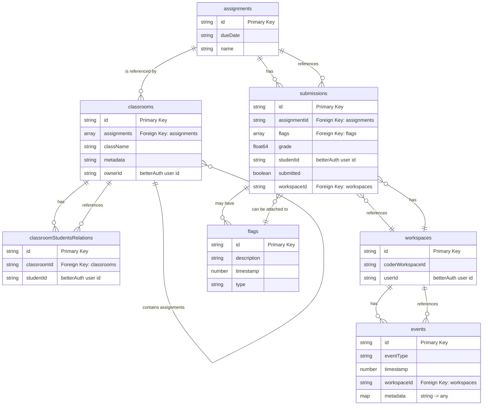
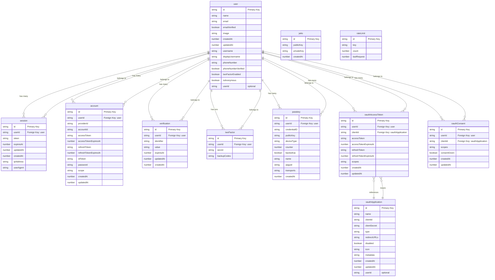

# Database Schema Diagram

## Application Schema

## Better Auth Schema

## Table Descriptions

### Application Tables

#### assignments

Stores assignment information including due dates and names.

#### classrooms

Represents classroom entities with references to assignments and an owner.

#### classroomStudentsRelations

Many-to-many relationship table linking classrooms to students.

#### events

Tracks events with timestamps, associated with specific workspaces.

#### flags

Stores flag information that can be attached to submissions.

#### submissions

Contains assignment submission data including grades, status, and workspace references.

#### workspaces

Maps coder workspaces to users.

### Better Auth Tables

#### user

Core user table storing authentication and profile information. The `id` field is referenced throughout the application schema as "betterAuth user id".

#### session

Manages user sessions with token-based authentication, including IP address and user agent tracking.

#### account

Stores OAuth provider account information, linking external auth providers (Google, GitHub, etc.) to local users.

#### verification

Stores verification tokens for email verification and other verification processes.

#### twoFactor

Contains two-factor authentication secrets and backup codes for users with 2FA enabled.

#### passkey

Stores WebAuthn passkey credentials for passwordless authentication.

#### oauthApplication

Defines OAuth applications that can be registered with the system.

#### oauthAccessToken

Manages OAuth access tokens for applications.

#### oauthConsent

Tracks user consent for OAuth applications to access their data.

#### jwks

Stores public/private key pairs for JWT signing.

#### rateLimit

Implements rate limiting by tracking request counts per key.

## Cross-Reference Notes

The application schema references Better Auth users via:

- `classrooms.ownerId` → `user.id`
- `classroomStudentsRelations.studentId` → `user.id`
- `submissions.studentId` → `user.id`
- `workspaces.userId` → `user.id`
